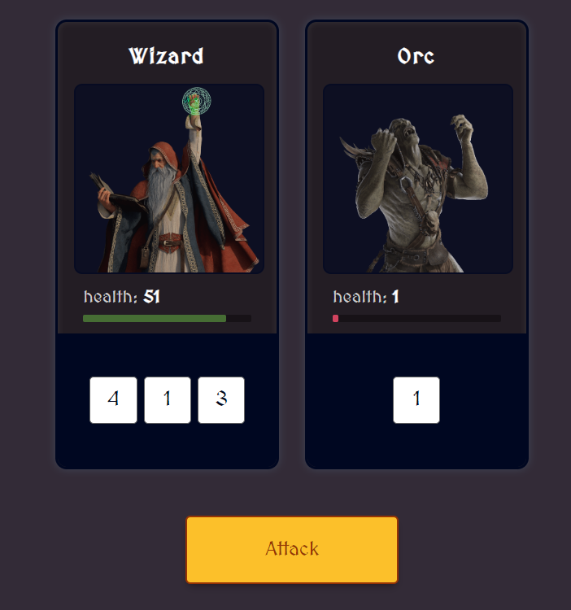

## Table of contents

- [Overview](#overview)
  - [The challenge](#the-challenge)
  - [Screenshot](#screenshot)
  - [Links](#links)
  - [How to install](#how-to-install)
- [My process](#my-process)
  - [What I learned](#What-I-learned)

## Overview

### The challenge
Monsters Game

### Screenshot

### Links

- Solution URL: [GitHub](https://github.com/memo-ibrahim-alean/Monsters-Game)
- Live Site URL: [Live](https://memo-ibrahim-alean.github.io/Monsters-Game/)

### How to install

- Clone Repo or Download Zip
- That's it! 🎉

## My process

### What I learned

- Object destructuring
- The .map() method
- The .join() method
- Returning a function inisde a function
- Creating new arrays with the Array constructor
- The .fill() method
- Constructor functions
- The this keyword
- Method on constructor functions
- Object.assign
- Import / Export
- The .reduce() method
- The ternary operator
- Arrow functions
- The setTimeout() method
